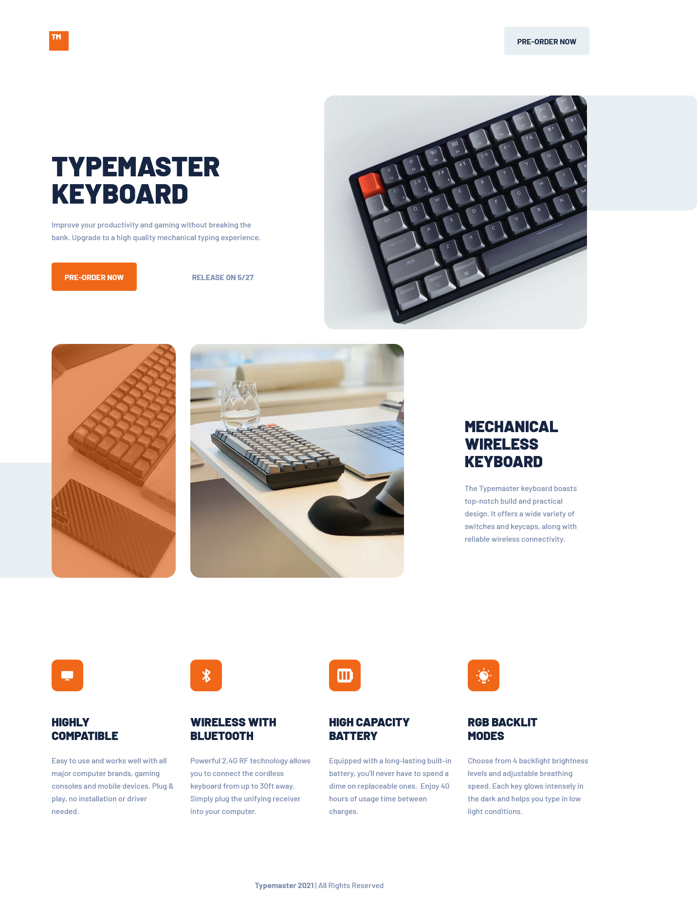

# Typemaster pre-launch landing page solution

## Table of contents

- [Frontend Mentor - Typemaster pre-launch landing page solution](#frontend-mentor---typemaster-pre-launch-landing-page-solution)
  - [Table of contents](#table-of-contents)
  - [Overview](#overview)
    - [The challenge](#the-challenge)
    - [Screenshot](#screenshot)
    - [Links](#links)
  - [My process](#my-process)
    - [Built with](#built-with)
    - [What I learned](#what-i-learned)
    - [Continued development](#continued-development)
  - [Author](#author)

## Overview

### The challenge

- Build responsive website that matches the design guides given
- match the figma mockups at breakpoints of 375px, 786px, and 1440px
- Add responsive features between these breakpoints
- match componets size pixel to pixel with design files

### Screenshot



### Links

- Solution URL: [Github Solution](https://github.com/jwdesjardin/typemaster-prelaunch-landing-page)
- Live Site URL: [Typemaster Keyboard Pre-Launch Landing](https://typemaster-prelaunch-landing-page.vercel.app/)

## My process

### Built with

- Semantic HTML5 markup
- CSS custom properties
- Flexbox
- CSS Grid
- Mobile-first workflow
- [React](https://reactjs.org/) - JS library
- [Next.js](https://nextjs.org/) - React framework

### What I learned

#### Mobile first

I tried to use mobile first design pattern while trying to write efficient CSS code that uses utility classes.

CSS can be broken down to Colors & Values, Typography, Layout, Images. Utility classes can be used for spans, containers.

#### Image Overlay with Psuedo Elements

The ::before and ::after psuedo elements can be used to create an overlay element inside a div. The psuedo element will not work on an img tag alone so in order to work around this i placed the image in a div wrapper with the same dimensions. Then i added the psuedo element to this wrapper and added the same border styles.

I also tried doing this with just one div and using the background-image CSS property which works but when setting the desired width and height of the image i was unable to get the write view of the image to match the mockups using any of the background size or position properties. Using the image property height and width the image is skewed from its initial values and matched the figma design files better.

```html
<div className="secondary-image-wrapper">
	<div className="secondary-image-left"></div>
</div>
```

```scss
.secondary-image-wrapper {
	margin: 6.4vw 0;
	transform: translateX(-6.4vw);
}

.secondary-image-wrapper::after {
	content: '';
	width: 100%;
	height: 100%;
	background-color: rgba(#f16718, 0.6);
	position: absolute;
	top: 0;
	left: 0;
	z-index: 2;
	border-radius: 0 20px 20px 0;
}
```

#### Responsive units

I wanted to make the project more responsive between the mobile, tablet and desktop screen sizes. I made all the images widths and heights based on viewport widths instead of using px widths. This made the images stay at the same aspect ratio but grow to fill the screen responsively throughout all screen sizes. At the desktop screen size i left the images at a max pixel width adn used a container with a max width to keep all the content togehter in the middle of the screen.

```html
<div className="secondary-image-right"></div>
```

```scss
.secondary-image-right {
	border-radius: 20px;
	margin: 6.4vw 0;
	background-image: url('/mobile/image-glass-and-keyboard.jpg');
	background-size: cover;
	width: 58.7vw;
	height: 51.46vw;
}
```

#### Flex row

I used this flex-row to show all these on the row in the desktop screen but be on different rows in the mobile and tablet screens. In the mobile and tablet screens the last section has a width of 100% but in the desktop version the width is redduced to be able to fit in the same flex row as the two preceeding images.

```html
<div className="flex-row container">
	{/* OVERLAY IMAGE */}
	<div className="secondary-image-wrapper">
		<div className="secondary-image-left"></div>
	</div>

	{/* SECOND IMAGE */}
	<div className="secondary-image-right"></div>

	{/* SECTION */}
	<section className="section-secondary">
		<h2>Mechanical wireless keyboard</h2>
		<p>
			The Typemaster keyboard boasts top-notch build and practical design. It offers a wide variety
			of switches and keycaps, along with reliable wireless connectivity.
		</p>
	</section>
</div>
```

### Continued development

- I will keep using the mobile first method of coding this seems to be the minmialist way to write the least code and only the code that you need.

- I will use reposonsive units for images. Percentages or VW.

- Separating CSS files into Colors and Values, Typography, Layout, Images, untilities.

## Author

- Website - [Joey Desjardin](https://www.joeydesjardin.com)
- Frontend Mentor - [@jwdesjardin](https://www.frontendmentor.io/profile/jwdesjardin)

This is a solution to the [Typemaster pre-launch landing page challenge on Frontend Mentor](). Frontend Mentor challenges help you improve your coding skills by building realistic projects.
